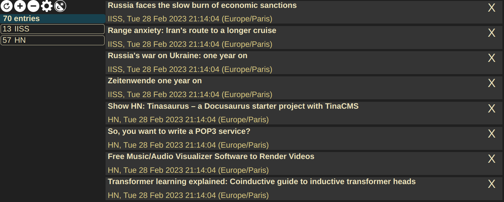

# rssify :: Webpage -> Feed
rssify is a Haskell library that makes hosting a RSS feed for any webpage easy. In the simplest case, you only need to provide a function that generates a [Feed](https://hackage.haskell.org/package/feed-1.3.2.1/docs/Text-Feed-Types.html) from a list of [HTML Tags](https://hackage.haskell.org/package/tagsoup-0.14.8/docs/Text-HTML-TagSoup.html) to get a Scotty server that serves this feed.

# Tutorial
*An executable version of the examples below is available in /Examples*

## Overview
Our goal is to produce two `RssifyApp` values, that we'll pass to `rssify` to run a server. This will be our `main` function:

```haskell
main :: IO ()
main = rssify [ example, example2 ]
```

`rssify` builds and runs a Scotty server from a list of `RssifyApp`.

```haskell
rssify :: [RssifyApp] -> IO ()
```

Here are the constructors of the types we'll have to build.

```haskell
data RssifyApp = FromHtml String ([Tag Text] -> Feed) RssifyAppSettings
               | FromIO (IO Feed) RssifyAppSettings

data RssifyAppSettings = RssifyAppSettings
  { refreshInterval :: Int
  , appUrl :: String
  }
```

## First example
Our first example will be a RSS feed of the posts on news.ycombinator.com. We'll focus on getting only the title and link of each post.

We'll use the `FromHtml` variant of the `RssifyApp`: the only non-trivial part is to write a method to convert a list of `TagSoup.Tag` to a `Feed`. After looking at the structure of the page in the dev tools of our browser, we find a pattern that is selective of entries, and contains the data we need:
1. A `<span>` with the `titleline` class.
2. An `<a>` with the `href` pointing to the URL of the link, with the inner text set to the title of the article.

The following functions uses this pattern to extract the info from the list of Tags of the page:

```haskell
getTitlesAndLinks :: [TagSoup.Tag T.Text] -> [(T.Text, T.Text)]
getTitlesAndLinks ( TagSoup.TagOpen "span" [("class", "titleline")]
                  : TagSoup.TagOpen "a" [("href", link)]
                  : TagSoup.TagText title
                  : rest) = (title, link) : getTitlesAndLinks rest
getTitlesAndLinks (_:xs) = getTitlesAndLinks xs
getTitlesAndLinks [] = []
```

Now that we have a list of `(title, link)`, we can map the following function over it to get a list of RSS Items.

```haskell
toHNEntry :: T.Text -> T.Text -> RSS.Item
toHNEntry title link = RSS.Item
  { RSS.itemURI = link
  , RSS.itemTitle = title
  , RSS.itemLink = link
  , RSS.itemDesc = Nothing
  , RSS.itemDC = []
  , RSS.itemTopics = []
  , RSS.itemContent = []
  , RSS.itemOther = []
  , RSS.itemAttrs = []
  }
```

Then, we can build a Feed from the list of entries:

```haskell
buildHNFeed :: [RSS.Item] -> Feed
buildHNFeed items = RSS1Feed $ RSS.Feed
  { RSS.feedVersion = "1"
  , RSS.feedChannel = RSS.nullChannel "" "hn"
  , RSS.feedImage = Nothing
  , RSS.feedItems = items
  , RSS.feedTextInput = Nothing
  , RSS.feedTopics = []
  , RSS.feedOther = []
  , RSS.feedAttrs = []
  }
```

Finally, we can use these 3 functions to define the `[TagSoup.Tag T.Text] -> Feed` functions we needed:

```haskell
parseHn :: [TagSoup.Tag T.Text] -> Feed
parseHn tagList = buildHNFeed (uncurry toHNEntry <$> getTitlesAndLinks tagList)
```

The last step is to build the `RssifyApp`, we just have to supply values for:

1. The URL of the webpage to parse.
2. How often our feed will be refreshed, with the content of the original page, in minutes.
3. The path to the feed on our domain.

```haskell
example :: RssifyApp
example = FromHtml "https://news.ycombinator.com/news" parseHn settings
  where settings = RssifyAppSettings { refreshInterval = 10
                                     , appUrl = "/example"
                                     }
```

We're done! We can pass this `RssifyApp` to `rssify` in our `main` function, and when we run our executable, we'll have a webserver responding to GET requests at /example with a RSS feed listing the articles on the front page of Hacker News.

## 2nd example
In our second example, we'd like to build a RSS feed of the articles posted on the page of the [IISS](https://www.iiss.org/blogs). We'll use the `FromIO` data constructor of `RssifyApp`. The only difference compared to the previous example is that we need to supply a function with the `IO Feed` type instead of `[Tag Text] -> Feed`. 

After inspecting the HTML returned by GET requests at that endpoint, we uncover a major hurdle: the page uses React and the information we're looking for is in `<script>` tags, in JSON format: the HTML is only rendered by the browser after the page is loaded. We could try to parse the content of the script tags or use a browser automation tool like Selenium, but we quickly find a simpler approach.

At the bottom of our page, there are buttons to navigate to previous pages of articles. Switching pages using this button makes a call to an undocumented API, that returns a JSON file listing every particle of the selected page. This is the format of the API request:

    curl 'https://www.iiss.org/api/filter' \
        -H 'accept: application/json' \
        -H 'content-type: application/json'
        -d '{"templateId":["{6BCFD2C9-4F0B-4ACE-95D7-D14C8B60CD4D}"],"componentId":"{E9850380-3707-43C9-994F-75ECE8048E04}","page":1,"amount":10,"filter":{},"tags":null,"sortType":"DateDesc","restrictionType":"None"}'


The meaning of the templateId and componentId fields isn't clear, but they are necessary, and don't change between sessions (even days apart). As a result, writing a method that provides `IO Feed` is simple: we only need to write a `wreq` POST request with the headers and body listed above, and deserialize the received JSON into a `Feed`. The first part is done like so:

```haskell
getFeedBS :: IO ByteString
getFeedBS = do
  resp <- Wreq.postWith options "https://www.iiss.org/api/filter" requestBody
  pure $ resp ^. Wreq.responseBody
    where options = Wreq.defaults
                  & Wreq.header "accept" .~ ["application/json"]
                  & Wreq.header "content-type" .~ ["application/json"]
          requestBody :: ByteString
          requestBody = "{\"templateId\":[\"{6BCFD2C9-4F0B-4ACE-95D7-D14C8B60CD4D}\"],\"componentId\":\"{E9850380-3707-43C9-994F-75ECE8048E04}\",\"page\":\"1\",\"amount\":10,\"filter\":{},\"tags\":null,\"sortType\":\"DateDesc\",\"restrictionType\":\"None\"}"
```

Parsing the JSON received is not complicated with `aeson`: I will omit it from this tutorial, although it's obviously implemented in `examples/Example.hs`.

We can then build our second `RssifyApp`.

```haskell
example2 :: RssifyApp
example2 = FromIO getFeed settings
  where getFeed = mkFeed . parseEntries <$> getFeedBS
        settings = RssifyAppSettings { refreshInterval = 60
                                     , appUrl = "/example2"
                                     }
```

ParseEntries parses a list of items from the JSON bytestring, and mkFeed builds a feed from these entries. They are composed and then fmapped over getFeedBS to make a `IO Feed`.

## Running the server
Now, all that's left is to write our main function:

```haskell
main :: IO ()
main = rssify [ example, example2 ]
```

, compile our project, run the server and check if it worked. We'll subscribe to these feeds with my [MPFS](https://github.com/ostnam/mpfs) feed reader.

Here's what it looks like after subscribing to `http://localhost:8000/example` and `http://localhost:8000/example2` in the feed reader:

 

It worked, although the publishing time of entries in our second example is incorrect, but we can always fix that later. 

## Summing up

In our first example, we implemented a function to convert HTML to a `Feed`:

```haskell
parseHn :: [TagSoup.Tag T.Text] -> Feed
```

And in the second, a function describing how to produce a `Feed` in the IO monad:

```haskell
getFeed = mkFeed . parseEntries <$> getFeedBS
```

We then built a `RssifyApp` using the appropriate constructor and settings:

```haskell
example :: RssifyApp
example = FromHtml "https://news.ycombinator.com/news" parseHn settings
  where settings = RssifyAppSettings { refreshInterval = 10
                                     , appUrl = "/example"
                                     }

example2 :: RssifyApp
example2 = FromIO getFeed settings
  where getFeed = mkFeed . parseEntries <$> getFeedBS
        settings = RssifyAppSettings { refreshInterval = 60
                                     , appUrl = "/example2"
                                     }
```

And after passing them to `rssify`, we got a web server that builds an RSS feed from each of the `RssifyApp`, and serves it at the specified URL to anyone who sends a GET requests. At the specified interval, the content of our feed is refreshed with the latest entries on the website. We can now easily host our own RSS feed for any page that we want.
